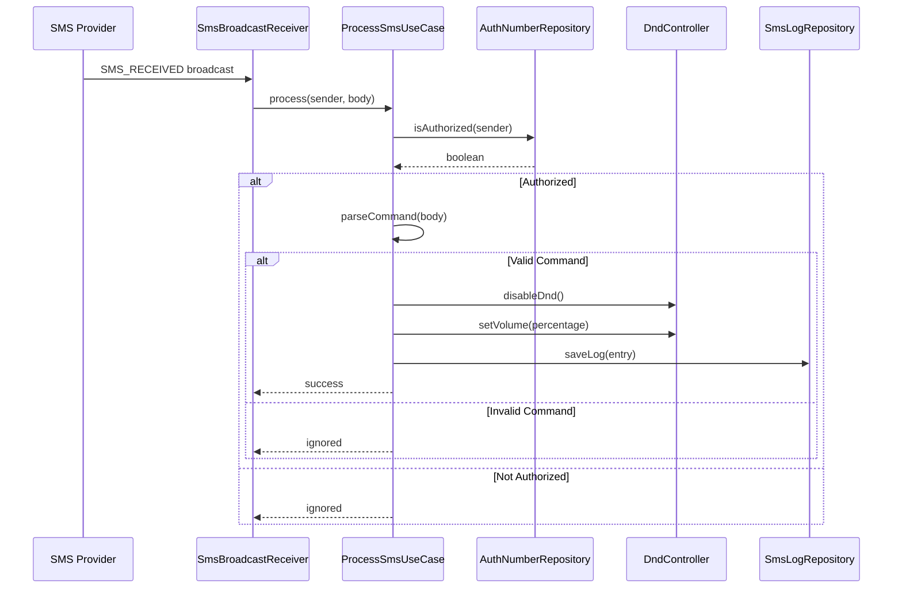

# PRD: SMS DND Manager

## Metadata
- **ID**: PRD-001
- **Status**: active
- **Priority**: high
- **Created**: 2026-03-01
- **Author**: Android Developer

## Problem Statement

Users who frequently put their phones in Do Not Disturb (DND) mode or mute them may miss important calls/messages. In emergency situations, authorized contacts (family, close friends, on-call colleagues) need a way to remotely disable DND mode or restore ringer volume without the user having to manually intervene. This is especially useful for:
- Parents reaching children who have muted their phones
- On-call professionals who need to be reachable
- Emergency contacts who need guaranteed reachability

## Proposed Solution

An Android application that listens for incoming SMS messages from a pre-defined whitelist of phone numbers. When an SMS contains a special activation code (e.g., "undnd50"), the app automatically:
1. Disables DND mode (if active)
2. Sets the ringer volume to the specified percentage (e.g., 50% for "undnd50")
3. Optionally sends a confirmation reply SMS

The app provides a simple UI for managing authorized numbers and configuring settings.

## Requirements

### Functional Requirements
- **FR-1**: The app must listen for incoming SMS messages in real-time, even when not actively running
- **FR-2**: The app must maintain a whitelist of authorized phone numbers that can trigger DND deactivation
- **FR-3**: The app must support configurable activation codes in format "undndXX" where XX is 0-100 (volume percentage)
- **FR-4**: The app must parse SMS content to extract the volume level from the activation code
- **FR-5**: The app must disable DND mode and set ringer volume to the specified level when triggered
- **FR-6**: The app must provide a UI to add, remove, and view authorized phone numbers
- **FR-7**: The app must allow configuration of whether to send confirmation SMS replies
- **FR-8**: The app must display a log of recent activation events with timestamps

### Non-Functional Requirements
- **NFR-1**: SMS processing latency must be under 2 seconds from receipt to action
- **NFR-2**: The app must handle Android Doze mode and battery optimizations gracefully
- **NFR-3**: All phone numbers must be stored securely using Android's encrypted preferences
- **NFR-4**: The app must handle permission denials gracefully with clear user guidance
- **NFR-5**: The app must be compatible with Android API 26+ (Android 8.0)
- **NFR-6**: Unit test coverage must exceed 80% for business logic

## Acceptance Criteria
- [ ] **AC-1**: Sending SMS "undnd50" from an authorized number disables DND and sets volume to 50%
- [ ] **AC-2**: Sending SMS "undnd100" from an authorized number sets volume to maximum
- [ ] **AC-3**: Sending SMS "undnd0" from an authorized number mutes the phone
- [ ] **AC-4**: SMS from non-authorized numbers do not trigger any action
- [ ] **AC-5**: User can add and remove authorized phone numbers through the UI
- [ ] **AC-6**: User can view a history log of all DND deactivation events
- [ ] **AC-7**: App handles missing permissions with clear instructions to the user
- [ ] **AC-8**: App continues to function after device reboot
- [ ] **AC-9**: App handles invalid activation codes gracefully (no crash, no action)
- [ ] **AC-10**: Unit tests cover SMS parsing, volume calculation, and authorization logic

## Technical Design

### Architecture
The app follows **Clean Architecture** with MVVM pattern:

```
app/
├── data/
│   ├── local/          # Encrypted SharedPreferences for settings
│   ├── repository/     # SettingsRepository, SmsLogRepository
│   └── model/          # Data models (SmsLogEntity, AuthorizedNumberEntity)
├── domain/
│   ├── model/          # Domain models (SmsMessage, VolumeCommand)
│   ├── usecase/        # ProcessSmsUseCase, ManageAuthorizedNumbersUseCase
│   └── repository/     # Repository interfaces
├── presentation/
│   ├── screen/         # MainActivity, SettingsScreen, LogScreen
│   ├── component/      # Reusable UI components
│   ├── navigation/     # Navigation graph
│   ├── theme/          # Material3 theme
│   └── viewmodel/      # SettingsViewModel, LogViewModel
├── receiver/           # SmsBroadcastReceiver
├── service/            # SmsProcessingService (foreground service for reliability)
└── di/                 # Hilt modules
```

### Key Components

#### 1. SMS Broadcast Receiver
- Registers for `android.provider.Telephony.SMS_RECEIVED` broadcasts
- Extracts sender number and message body
- Delegates processing to `ProcessSmsUseCase`

#### 2. Volume Command Parser
```kotlin
// Pattern: undnd[0-9]{1,3}
fun parseCommand(message: String): VolumeCommand? {
    val regex = Regex("undnd(\\d{1,3})")
    return regex.find(message)?.let { match ->
        val percentage = match.groupValues[1].toInt().coerceIn(0, 100)
        VolumeCommand(percentage)
    }
}
```

#### 3. DND Controller
```kotlin
interface DndController {
    fun disableDnd()
    fun setRingerVolume(percentage: Int)
}
```

#### 4. Authorized Numbers Store
- Encrypted SharedPreferences for secure storage
- CRUD operations for phone number management
- Normalization of phone numbers (E.164 format)

### Permissions Required
- `android.permission.RECEIVE_SMS` - To receive SMS broadcasts
- `android.permission.READ_SMS` - To read message content
- `android.permission.SEND_SMS` - For optional confirmation replies
- `android.permission.MODIFY_AUDIO_SETTINGS` - To change ringer volume
- `android.permission.ACCESS_NOTIFICATION_POLICY` - To modify DND state

### Data Models

```kotlin
data class SmsMessage(
    val senderNumber: String,
    val body: String,
    val timestamp: Long
)

data class VolumeCommand(
    val percentage: Int // 0-100
)

data class AuthorizedNumber(
    val id: String,
    val phoneNumber: String,
    val displayName: String?, // Optional contact name
    val createdAt: Long
)

data class SmsLogEntry(
    val id: String,
    val senderNumber: String,
    val command: String,
    val volumeSet: Int,
    val timestamp: Long,
    val success: Boolean
)
```

### Sequence Diagram



## Mode Assignments

| Mode | Scope |
|------|-------|
| Mobile | Full Android app development including architecture, UI, SMS handling, and DND control |
| QA | Unit tests, integration tests, and manual testing of SMS scenarios |
| Security | Review permission handling and data storage security |
| Documentation | README, setup instructions, and user guide |

## Dependencies

### Android Libraries
- **Kotlin Coroutines + Flow**: Async operations and reactive streams
- **Jetpack Compose**: Modern UI toolkit
- **Material3**: Material Design components
- **Hilt**: Dependency injection
- **EncryptedSharedPreferences**: Secure local storage
- **Navigation Compose**: In-app navigation

### Testing
- **JUnit 5**: Unit testing framework
- **MockK**: Mocking for Kotlin
- **Turbine**: Flow testing utilities
- **Compose UI Testing**: UI testing

## Notes

### Security Considerations
- Phone numbers must be stored encrypted
- Activation codes should not be logged in plain text
- Consider rate limiting to prevent abuse
- Optional: PIN protection for settings access

### Edge Cases
- SMS received while app is in background/restricted state
- Multiple SMS arriving simultaneously
- Invalid/malformed phone numbers
- Device reboot - need to ensure receiver re-registers
- User denies critical permissions

### Future Enhancements
- Whitelist import from contacts
- Multiple activation code patterns
- Notification with undo action
- Widget for quick status check
- Dark/light theme support
