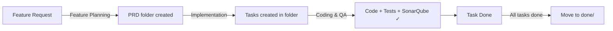

# AI-Assisted Project Template for KiloCode

A **framework-agnostic project template** that provides AI-assisted development workflows through KiloCode's custom modes, skills, and workflows. Designed for planning features, breaking them into tasks, implementing with quality gates, and verifying with SonarQube.

## Quick Start

1. **Clone this template** into your new project
2. **Install KiloCode** VS Code extension
3. **Configure SonarQube** MCP server (optional but recommended)
4. **Start building** — ask KiloCode for a new feature and the workflows guide you through

## How It Works



### Three Core Workflows

| Workflow | Trigger | Mode | Result |
|----------|---------|------|--------|
| [Feature Planning](.kilocode/workflows/feature-planning.md) | New feature request | Architect | Approved PRD folder |
| [Implementation](.kilocode/workflows/implementation.md) | Active PRD folder | Orchestrator | Task breakdown |
| [Coding & QA](.kilocode/workflows/coding-qa.md) | Task to implement | Various → QA | Verified code |

### Specialist Modes

| Mode | Slug | Purpose |
|------|------|---------|
| Backend | `backend` | APIs, services, business logic |
| Database | `database` | Schema, migrations, queries |
| DevOps | `devops` | CI/CD, Docker, infrastructure |
| Documentation | `documentation` | API docs, READMEs, ADRs |
| Frontend | `frontend` | UI components, web clients |
| Mobile | `mobile` | Android, iOS, cross-platform |
| Orchestrator | `orchestrator` | Task breakdown, coordination |
| QA | `qa` | Testing, code quality, SonarQube |
| Security | `security` | Vulnerability assessment, audits |

## Directory Structure

```
project-root/
├── .kilocodemodes              # Custom mode definitions (YAML)
├── .kilocoderules              # Project-wide coding rules
├── AGENTS.md                   # AI agent context and instructions
├── README.md                   # This file
├── CHANGELOG.md                # Tracks completed PRDs and milestones
│
├── PRD/                        # ALL PLANNING
│   ├── templates/
│   │   └── feature-folder/     # Template for new features
│   │       ├── PRD.md          # PRD template
│   │       └── tasks/
│   │           └── TASK.md     # Task template
│   ├── adr/                   # Architecture Decision Records
│   │   ├── templates/
│   │   │   └── adr-template.md
│   │   └── 0001-*.md
│   ├── 0001-feature-name/     # Feature folder (created when PRD approved)
│   │   ├── PRD.md
│   │   └── tasks/
│   │       └── TASK-*.md
│   └── done/                   # Completed features (moved here)
│
└── .kilocode/                 # ALL AI CODING CONFIG
    ├── instructions.md
    ├── workflows/              # 3 workflows
    │   ├── feature-planning.md
    │   ├── implementation.md
    │   └── coding-qa.md
    └── skills/                # 30+ skills
        ├── create-mobile-screen/
        ├── setup-mobile-project/
        └── ...
```

## Workflow Details

### 1. Feature Planning (Architect Mode)

When you request a new feature:

1. **Analyze** — Review requirements, ask clarifying questions
2. **Create PRD** — From template, fill in requirements, acceptance criteria, technical design
3. **Review** — Verify feasibility, identify risks
4. **Verify** — Checklist ensures quality before approval
5. **Approve** — User confirms, folder is ready

### 2. Implementation (Orchestrator Mode)

After PRD approval:

1. **Decompose** — Break PRD into discrete task files in the folder's `tasks/` subfolder
2. **Sequence** — Order tasks by dependencies (DB → Backend → Frontend → QA)
3. **Execute** — Each task follows the Coding & QA Workflow
4. **Track** — Monitor progress, handle blockers
5. **Complete** — All tasks done → Move folder to `PRD/done/`

### 3. Coding & QA (Various → QA Mode)

For each implementation task:

1. **Implement** — Code the feature in the appropriate mode
2. **Test** — Write unit, integration, and e2e tests
3. **Self-review** — Check against quality checklist
4. **SonarQube** — Automated quality gate verification
5. **Security** — Review if handling sensitive data
6. **Verify** — Confirm all acceptance criteria met
7. **Complete** — Mark task as done

## Quality Standards

- **SonarQube**: No new BLOCKER or HIGH severity issues
- **Coverage**: >80% unit test coverage for business logic
- **Security**: OWASP Top 10 review for sensitive features
- **Commits**: Conventional commits (`feat:`, `fix:`, `docs:`, etc.)

## Configuration Files

| File | Purpose |
|------|---------|
| `.kilocodemodes` | Custom mode definitions with roles, skills, and permissions |
| `.kilocoderules` | Project-wide coding rules and conventions |
| `.kilocode/instructions.md` | Global AI instructions for all modes |
| `AGENTS.md` | AI agent context, workflows, and common tasks |

## Prerequisites

- [VS Code](https://code.visualstudio.com/)
- [KiloCode Extension](https://marketplace.visualstudio.com/items?itemName=kilocode.kilo-code)
- [SonarQube](https://www.sonarqube.org/) (recommended for quality gates)

## License

This template is provided as-is for use in AI-assisted software projects.
